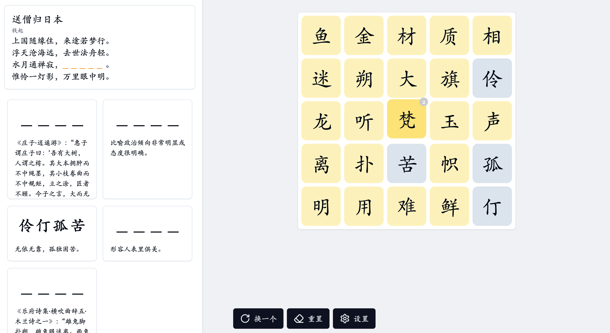

# 一个古诗小游戏

左侧是一个诗词和一些成语，右侧是一个可选择的表格，而诗词隐藏了一段，需要在右侧的表格选中缺少的句子。

有几个提示可以帮助你完成句子

* 缺少的句子的第一个字会在表格第一列，最后一个字会在最后一列
* 左侧有一些带解释的四字成语，在右侧正确选中后会帮你排除一些选项
* 右侧表格选中后，右上角会有一个数字，表示下一个正确的字符距离当前选中的字符的距离，在`上下左右`的四个位置上
* 表格里可能存在一些无法被成语或者诗词匹配的字符

